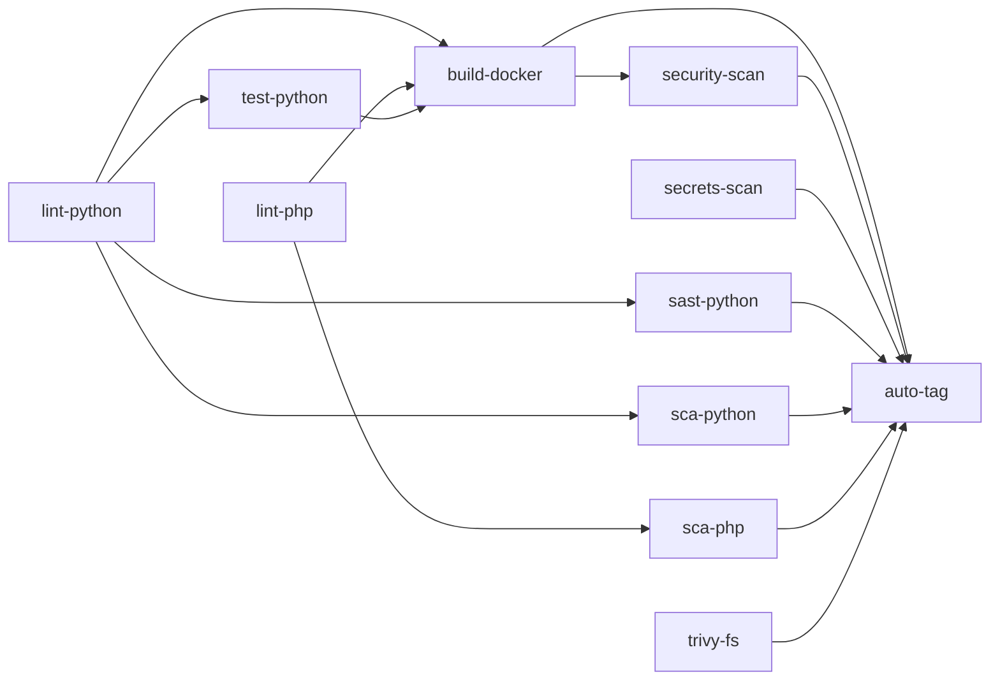

# CI pipeline - DAG

Source : [[Code/.github/workflows/ci.yml|ci.yml]]. 11 jobs.

## Bloquant sur main

`auto-tag` dépend de **tous** les scans sécurité → aucune release possible si CVE critique non résolue.

## Voir aussi

- [[07_CI-CD/_MOC]] · [[07_CI-CD/workflow-ci]] · [[07_CI-CD/release-flow]]
