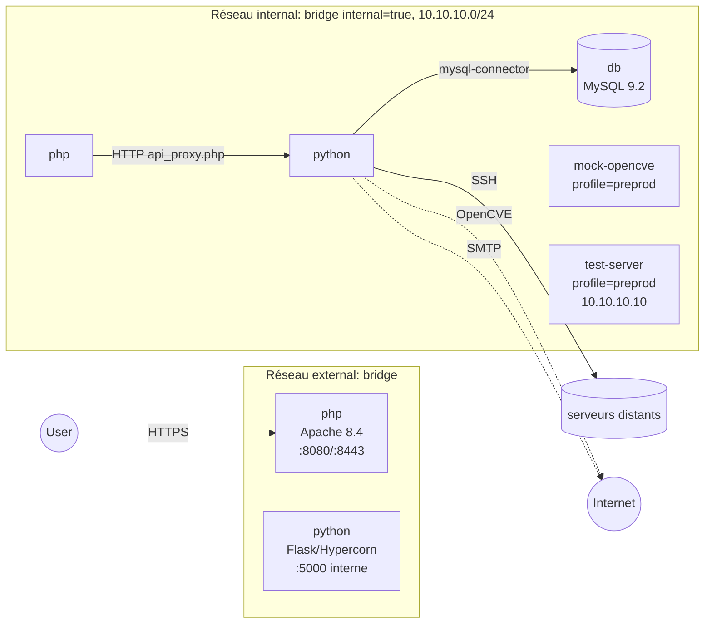

# Conteneurs Docker - vue d'ensemble

Source : [[Code/docker-compose.yml|docker-compose.yml]].

## Services

| Service | Image / build | Ports host | Réseaux | Profil |
|---|---|---|---|---|
| `php` | build `./php/Dockerfile` | 8080, 8443 | internal + external | - |
| `python` | build `./backend` | (expose 5000 interne) | internal + external | - |
| `db` | `mysql:9.2.0` | aucun (isolé) | internal | - |
| `composer` / `composer-update` | `composer:2` | - | external | `tools` |
| `mock-opencve` | build `./mock-opencve` | expose 9090 | internal | `preprod` |
| `test-server` | build `./test-server` | - | internal (10.10.10.10) | `preprod` |

## Volumes

- `db_data` - BDD MySQL.
- `php_sessions` - sessions PHP (séparées du bind `./www`).
- `platform_ssh_keys` - [[02_Domaines/platform-key|keypair Ed25519]] persistée (`/app/platform_ssh`).
- Bind mounts : `./www`, `./backend`, `./certs`, `./backups`, `./mysql/migrations` (ro).

## Healthchecks

- php : `curl -fsk https://localhost:443/`
- python : `curl -fsk https://localhost:5000/test`
- db : `mysqladmin ping`

## Voir aussi

- [[01_Architecture/network-zero-trust]] · [[10_Ops/docker-compose]] · [[04_Fichiers/docker-compose]]
