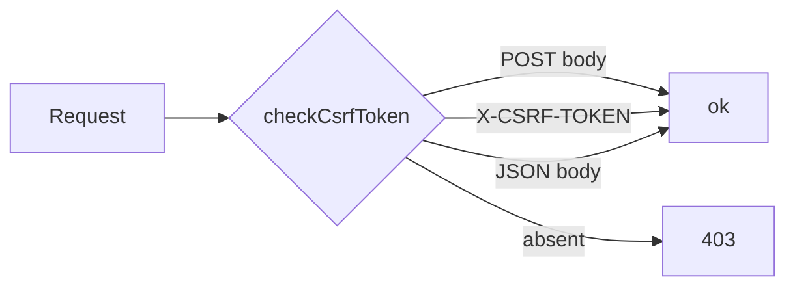

# CSRF unifié

Source : `checkCsrfToken()` côté PHP. Supporte 3 porteurs : POST body `csrf_token`, header `X-CSRF-TOKEN`, body JSON. Comparaison **timing-safe** (`hash_equals`).

## Voir aussi

- [[11_Glossaire/csrf]] · [[05_Fonctions/checkAuth]] · [[02_Domaines/auth]]
