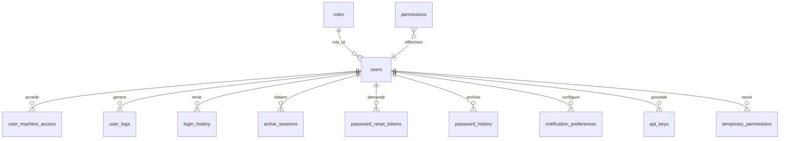
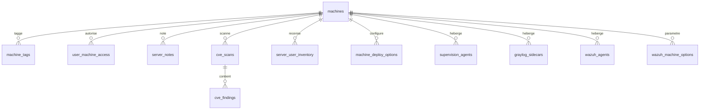

# ERD global (par domaine)

Grouper par domaine pour lisibilité. Les 38 migrations → [[08_DB/_MOC]]. Détail de chaque table → [[08_DB/tables]].

## Auth & RBAC

## Infrastructure

## Sécurité & audit

## Voir aussi

- [[08_DB/_MOC]] · chaque migration dans [[08_DB/migrations/_MOC]].
