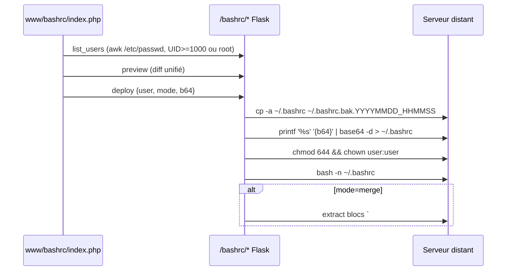

# Flow - Déploiement bashrc

Source : [[04_Fichiers/backend-routes-bashrc]], [[03_Modules/backend-bp-bashrc]], [[02_Domaines/bashrc]].

## Sécurité

- Username validé par regex `^[a-z_][a-z0-9_-]{0,31}$`.
- Contenu transmis **exclusivement** en base64 → pas d'injection shell.
- Vérifications via SSH, pas `docker exec` (cf. [[feedback_docker_namespaces]]).
- Permission [[02_Domaines/auth|can_manage_bashrc]] DB-vérifiée.

## Voir aussi

- [[02_Domaines/bashrc]] · [[04_Fichiers/backend-templates-bashrc_standard]] · [[08_DB/migrations/031_bashrc_permission]] · [[08_DB/migrations/032_bashrc_templates]]
