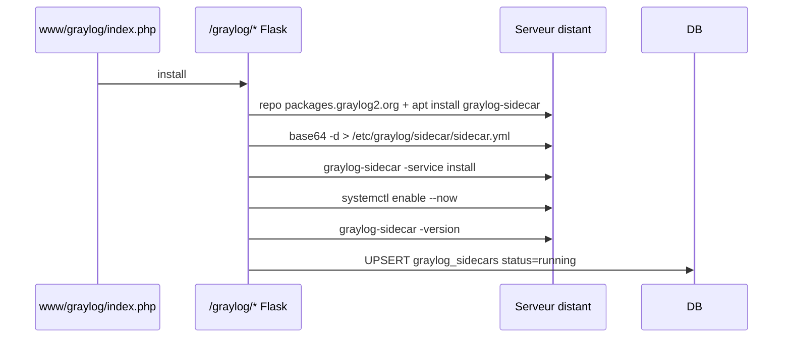

# Flow - Déploiement Graylog Sidecar

Source : [[04_Fichiers/backend-routes-graylog]], [[02_Domaines/graylog]].

## Éditeur collector

Textarea YAML/XML, validation `yaml.safe_load` backend pour filebeat, audit `[graylog] save_collector`.

## Voir aussi

- [[02_Domaines/graylog]] · [[08_DB/migrations/033_graylog]] · [[08_DB/tables/graylog_config]] · [[08_DB/tables/graylog_collectors]] · [[08_DB/tables/graylog_sidecars]]
