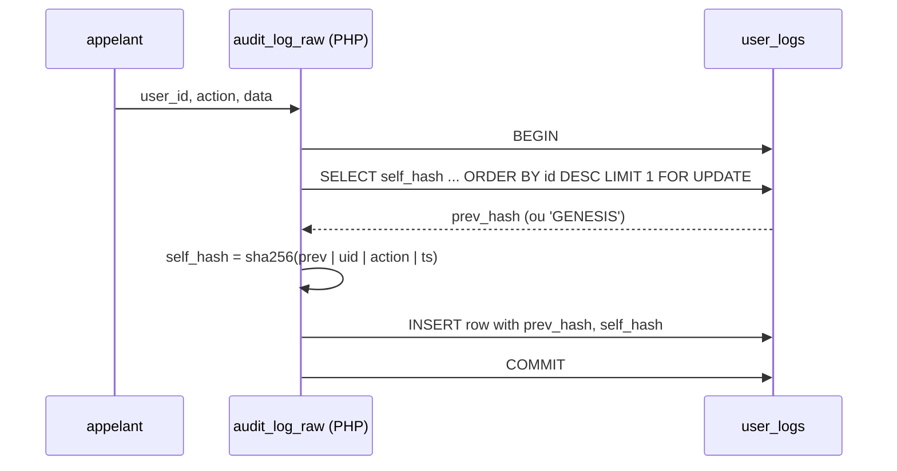

# Flow - Hash chain `user_logs`

Algo : `self_hash = SHA2-256(prev_hash | user_id | action | unix_ts)`. Genesis : `'GENESIS'`. Source : [[05_Fonctions/audit_log_raw]], [[08_DB/migrations/036_audit_log_hash_chain]].

## Vérification

[[05_Fonctions/audit_verify]] - recalcule toute la chaîne, renvoie `integrity: OK | BROKEN` avec `type: MISMATCH | PREV_BROKEN` et `id`.

## Limite connue

Pas de KMS externe. Attaquant avec accès DB + code peut recalculer la chaîne. Mitigation future : stockage WORM externe. Cf. [[06_Securite/audit-findings/finding-hash-chain-no-kms]].

## Voir aussi

- [[02_Domaines/audit]] · [[05_Fonctions/audit_seal]] · [[06_Securite/hash-chain]]
