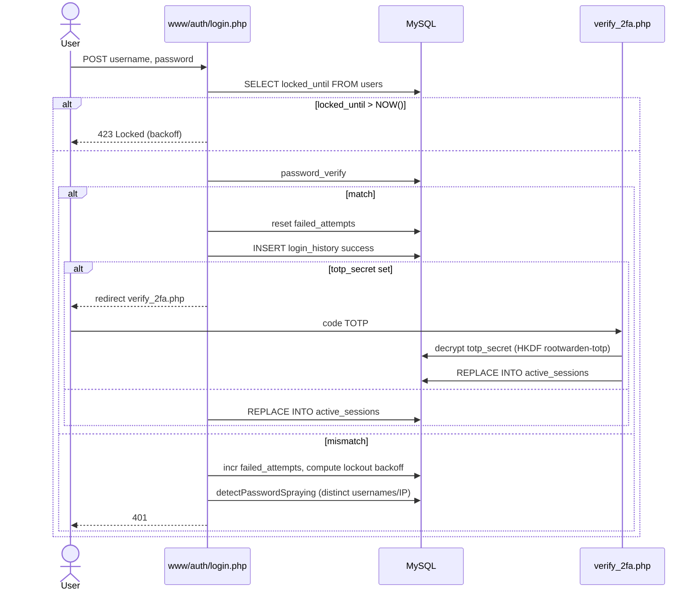

# Flow - Login + 2FA + lockout

## Backoff (v1.14.1)

3 échecs → 60 s · 4 → 300 s · 5 → 900 s · 6 → 3600 s · 7+ → 14400 s. Source : [[04_Fichiers/www-auth-login]].

## Voir aussi

- [[02_Domaines/auth]] · [[05_Fonctions/checkAuth]] · [[06_Securite/rate-limit]]
- [[04_Fichiers/www-auth-login]] · [[04_Fichiers/www-auth-verify_2fa]] · [[08_DB/migrations/035_login_hardening]]
