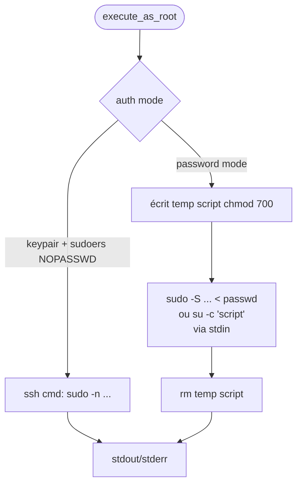

# Flow - `execute_as_root` : sudo NOPASSWD vs su -c

Double chemin d'élévation. Source : [[04_Fichiers/backend-ssh_utils]] · [[05_Fonctions/execute_as_root]].

## Règle clé

- Mot de passe **jamais** en argument shell (OPS leak via `ps`).
- Passage par stdin ou via fichier temporaire chmod 700 supprimé après.
- Fallback `su -c` si `sudo` absent.

## Voir aussi

- [[05_Fonctions/execute_as_root]] · [[05_Fonctions/execute_as_root_stream]] · [[02_Domaines/ssh]] · [[06_Securite/threat-model]]
