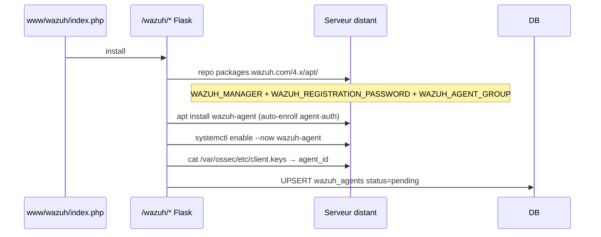

# Flow - Déploiement Wazuh Agent

Source : [[04_Fichiers/backend-routes-wazuh]], [[02_Domaines/wazuh]].

## Rules editor

Textarea XML (rules/decoders) ou CDB plain text → validation `xmllint --noout` via subprocess avec tempfile. Audit `[wazuh] save_rule`.

## Options par serveur

FIM paths JSON array (regex `^/[^;&|$\`]`), log_format whitelist, syscheck_frequency ∈ [60, 604800], checkboxes AR / SCA / rootcheck.

## Voir aussi

- [[02_Domaines/wazuh]] · [[08_DB/migrations/034_wazuh]] · [[08_DB/tables/wazuh_agents]] · [[08_DB/tables/wazuh_rules]] · [[08_DB/tables/wazuh_machine_options]]
