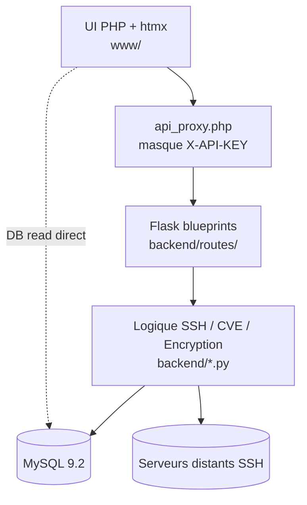

# Couches applicatives (onion)

## Responsabilités par couche

| Couche | Rôle | Référence |
|---|---|---|
| UI PHP | rendu, CSRF, checkAuth/checkPermission DB-verified | [[02_Domaines/auth]] |
| Proxy | sérialisation + header X-User-* | [[03_Modules/www-api_proxy]] |
| Blueprints Flask | routage + décorateurs (`require_api_key`, `require_permission`) | [[04_Fichiers/backend-routes-helpers]] |
| Logique métier | SSH, chiffrement, scheduler | [[04_Fichiers/backend-ssh_utils]] · [[04_Fichiers/backend-encryption]] |
| DB | source de vérité (users, perms, logs, configs) | [[08_DB/_MOC]] |

## Voir aussi

- [[01_Architecture/containers-docker]] · [[01_Architecture/csrf-model]] · [[05_Fonctions/_MOC]]
